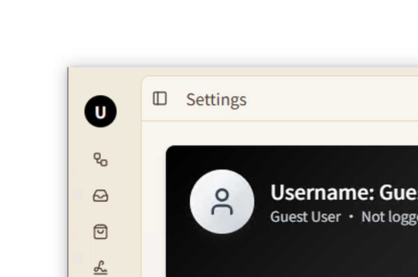

# window shadows v2

This crate is a Tauri v2-ready alternative to [window-shadows](https://github.com/tauri-apps/window-shadows).

Since Tauri v2 already supports toggling window shadows, the original window-shadows crate stopped receiving updates. However, this crate continues to provide the native shadow implementation that some apps still need.

## Why we need it?

My app ships with a custom title bar. On Windows 10, enabling shadows results in the following bug:



The top shadow becomes inactive and leaves a white line. By porting the native shadow implementation from window-shadows and adapting it for Tauri v2, the issue is resolved.

## Usage

```rust
.setup(|app| {
    window_shadows_v2::set_shadows(app, true);
})
```
